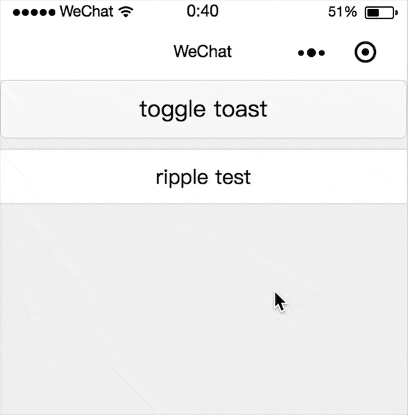

# mpvue-ripple

> mpvue-ripple is a ripple component for mpvue.

## Screenshots



## Install

```bash
npm install mpvue-ripple --save
```

## Usage

```html
<template>
  <div>
    <ripple ripple-class="ripple-test">
      <div>ripple fill</div>
    </ripple>
    <ripple ripple-class="ripple-test" type="circle">
      <div>ripple circle</div>
    </ripple>
  </div>
</template>

<script>
import ripple from 'mpvue-ripple'

export default {
  components: {
    ripple
  }
}
</script>

<style>
page {
  background: #f0f0f0;
}
.ripple-test {
  margin-top: 10px;
  background: #fff;
  text-align: center;
  padding: 12px;
  border-top: 0.5px solid #ddd;
  border-bottom: 0.5px solid #ddd;
}
</style>
```

## Props

| 参数        | 说明                      | 类型      | 可选值  | 默认值    |
| ---------  | ----------------------- | ------- | ---- | ------ |
| duration    | 水波纹持续时间     | Number | -    | 1000   |
| ripple-class | 外层包裹器的class | String | - | - |
| type | 水波纹类型 | String | `fill` `circle` | `fill` |

## Slot

| name | 说明 |
| ---- | ---- |
| default | - |

## TODO

- api
- test

## Other Component

- [mpvue-toast](https://github.com/linrui1994/mpvue-toast)
